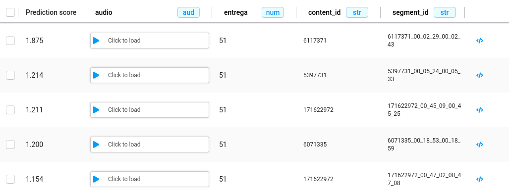
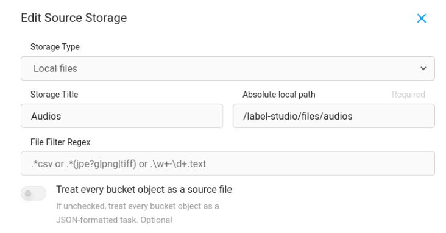

## About
A docker compose deployment of Label studio data labeling and annotation tool.

## Prerequisites

Make

[Docker](https://docs.docker.com/engine/install/ubuntu/)

[Docker compose](https://docs.docker.com/compose/install/)

## Environment Variables
To run this project, you will need to add the following environment variables to your .env file.


`DJANGO_DB`

`POSTGRE_NAME`

`POSTGRE_USER`

`POSTGRE_PASSWORD`

`POSTGRE_PORT`

`POSTGRE_HOST`

`POSTGRES_HOST_PORT`

`LABEL_STUDIO_VOLUME_HOST_AUDIO_PATH`

Example .env file

```bash
DJANGO_DB=default
POSTGRE_NAME=labelstudio
POSTGRE_USER=YOUR_PASTGRES_DATABASE_USER
POSTGRE_PASSWORD=YOUR_PASTGRES_DATABASE_PASSWORD
POSTGRE_PORT=5432
POSTGRE_HOST=postgres
POSTGRES_HOST_PORT=YOUR_PASTGRES_DATABASE_HOST_PORT
LABEL_STUDIO_VOLUME_HOST_AUDIO_PATH=./data/files
```


## Deployment (docker compose)

To deploy the label studio annotation tool

```bash
  make deploy
```
To stop deployment run
```bash
  make stop
```
To delete deployment run
```bash
  make stop
```


## Setup Label Studio for audio annotation

### Annotation interface
Once you are in the creation project setup screen, navigate to *Labeling Setup -> Custom template*
You will see some audio templates by default provided by label studio.

The following example we are already using:

```html
<View>
  <Audio name="audio" value="$audio" zoom="true" hotkey="ctrl+enter" />
  <Header value="Provide Transcription" />
  <TextArea name="transcription" toName="audio"
            rows="4" editable="true" maxSubmissions="1" />
    <Choices name="approved" toName="audio" showInLine="true">>
    <Choice value="approved"/>
    <Choice value="to revision" />
  </Choices>
</View> 
```

How to interface is supposed to view with the above example:




### Serve audio files

To listen to audio files on the interface, you have to set up cloud or database storage as the source on the setting.

Navigate to project *Settings -> Cloud Storage -> Add Source Storage*

Fill the fields with your audio files path directory


If you would like to change the audio files directory, be aware of changing ```LABEL_STUDIO_VOLUME_HOST_AUDIO_PATH``` on the ```.env``` file.

[Check out label studio documentation for additional information](https://docs.humansignal.com/guide/storage.html#Local-storage)

*NOTE:*
We do not recommend using this approach. Use it if you don't have access to a cloud storage alternative (S3)
Label studio, by default, supports storing input/output files directly to S3.

### Sample annotation format

You could customize the annotation format as whatever you like.
Only if you using local file audio storage, be aware of keeping ```?d=audios``` variable (audios parent directory) before audio path.

[Check out label studio documentation for more about input formats](https://labelstud.io/guide/tasks.html)

```json
{
  "data": {
    "audio": "/data/local-files/?d=audios/wav/5621300/5621300_00_00_07_00_00_17.wav",
    "content_id": "5621300",
    "entrega": 6,
    "segment_id": "5621300_00_00_07_00_00_17"
  },
  "annotations": [
    {
      "result": [
        {
          "value": {
            "text": [
              "És el descobriment de l'any que et dic de l'any de la dècada, no del segle i el més important és la via directe per guanyar el premi Nobel ai quina alegria,"
            ]
          },
          "from_name": "transcription",
          "to_name": "audio",
          "type": "textarea"
        }
      ]
    }
  ],
  "predictions": [
    {
      "score": 0.125,
      "model_version": "version 0",
      "result": [
        {
          "value": {
            "text": [
              "és el descobriment de l'any que et dic de l'any de la dècada no del segle i el més important és la via directa per guanyar el premi nobel aque l'alegria"
            ]
          },
          "from_name": "transcription",
          "to_name": "audio",
          "type": "textarea"
        }
      ]
    }
  ]
}
```

### Import data to label studio
There are several ways to import you data to label studio, once you get you data in the expected format you could:

- Sync data from cloud or database storage.
- Import it from the Label Studio UI.
- If your data is stored locally, import it into Label Studio
- Send data using Label Studio Rest API.

### More information

For additional information, please check out label studio [official documentation](https://labelstud.io/guide/get_started.html)
Also, don't hesitate to ask us. You could [start a new discussion on this repository](https://github.com/langtech-bsc/label-studio-docker-compose/discussions/new/choose)